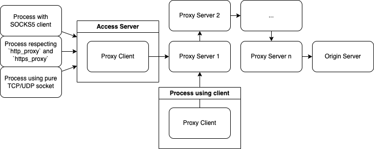
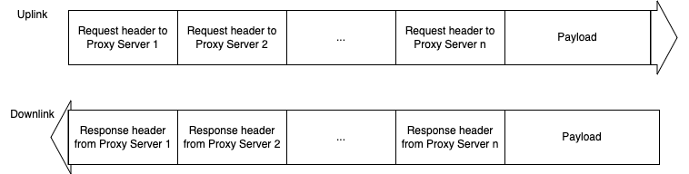

# Proxy

## Architecture

  
  

- Access Server:
  - as an access point, it:
    - implements TCP/UDP listeners, so that it can direct traffic from a process that does not understand the proxy protocol to the proxy
    - pre-defines the proxy chain, so that the downstream process does not need to know the proxy chain
- Proxy Client:
  - as a start of the proxy chain, it:
    - implements the proxy protocol, so that it can direct traffic to the proxy
    - defines the proxy chain, so that the client user can dynamically change the proxy chain without re-configuring those proxies
- Proxy Server:
  - as an traffic proxy, it:
    - is only responsible to a fragment of the stream (TCP) or a datagram (UDP), so that those responsibilities can be stacked and form a proxy chain

## Protocol

### TCP variant

  
  

- Request header includes the address to the next hop, so that the Proxy Server can connect to the next hop on the fly
- Response header includes the ok/error message from the proxy that creates this response
- Steps to fill the stream:
  1. Proxy Client writes all the request headers to the stream
  1. Each Proxy Server consumes the responsible request header and writes the response header to the stream
  1. Proxy Client consumes all the response headers
  1. If no error, Proxy Client reads/writes the payload from/to the stream

### UDP variant

Instead of directly operating a stream, UDP client treats each UDP datagram as a stream and follows the same steps as TCP variant.
