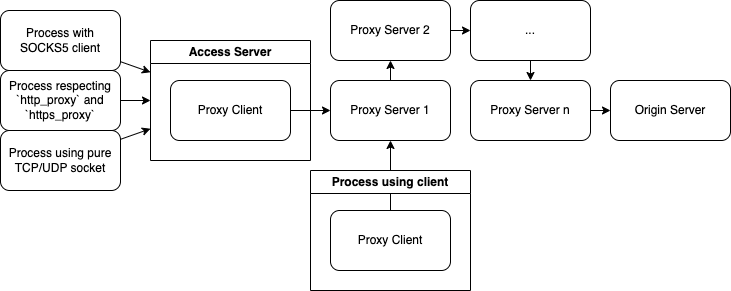
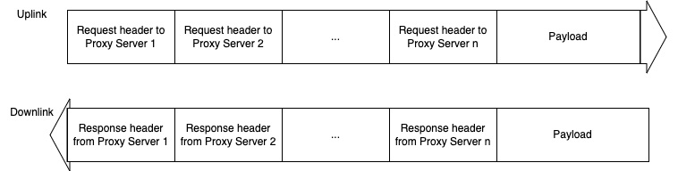

# Proxy

## Transport boundary

Proxy may select TCP or RTP as the transport beneath mux, but transport-independent proxy and mux behavior should depend only on their common reliable-stream contract. Keep RTP-specific setup and exceptional behavior in the RTP-facing adapter so switching the transport does not require another mux state machine.

## Architecture

  
  

- Access Server:
  - as an access point, it:
    - implements TCP/UDP listeners, so that it can direct traffic from a process that does not understand the proxy protocol to the proxy
    - pre-defines the proxy chain, so that the downstream process does not need to know the proxy chain
- Proxy Client:
  - as a start of the proxy chain, it:
    - implements the proxy protocol, so that it can direct traffic to the proxy
    - defines the proxy chain, so that the client user can dynamically change the proxy chain without re-configuring those proxies
- Proxy Server:
  - as an traffic proxy, it:
    - is only responsible to a fragment of the stream (TCP) or a datagram (UDP), so that those responsibilities can be stacked and form a proxy chain

## Named reverse tunnels

A private-side initiator can establish an outbound tunnel to a public-side responder and register it under a name. Neither endpoint has a destination: the destination still comes from the normal proxy-chain request header. The public side can use the registered tunnel as either a stream or UDP hop; one mux substream carries each UDP flow and preserves its datagram boundaries.

- The same `revtuntcp://name` and `revtunrtp://name` addresses work in stream and UDP chains. The initiator and responder use the same `header_key` to authenticate tunnel registration. A chain entry for the virtual hop uses that key for its normal proxy request header as well. See `server/config.toml` for configuration examples.
- Every hop in a stream or UDP proxy chain may define its own `payload_key`, while preserving the existing payload-key termination/layering bullet.
- Optional payload encryption terminates at the public proxy-chain entry and the private initiator, which must share the exact same `payload_key`. The virtual chain entry (`revtuntcp://name` / `revtunrtp://name`) carries that key as its payload key; the responder is transport-only and intentionally accepts no `payload_key`.
- The access client nests those payload layers in chain order, and each matching proxy server removes exactly its own layer before forwarding traffic to the next hop. A hop's upstream entry and its proxy server must use the same key.

## Protocol

### TCP variant

  
  

- Request header includes the address to the next hop, so that the Proxy Server can connect to the next hop on the fly
- Response header includes the ok/error message from the proxy that creates this response
- Steps to fill the stream:
  1. Proxy Client writes all the request headers to the stream
  1. Each Proxy Server consumes the responsible request header and writes the response header to the stream
  1. Proxy Client consumes all the response headers
  1. If no error, Proxy Client reads/writes the payload from/to the stream

### UDP variant

Instead of directly operating a stream, UDP client treats each UDP datagram as a stream and follows the same steps as TCP variant.
